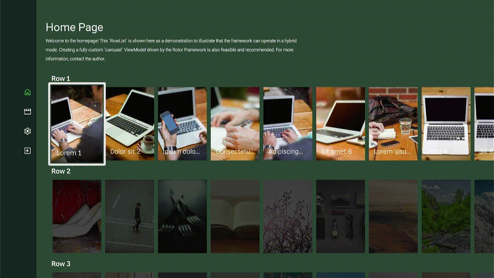

[](https://github.com/mobalazs/rotor-starter/actions/workflows/main-workflow.yml)


[](https://rokudevelopers.slack.com)

# 🚀 Rotor Starter

**A professional starter template for building Roku applications with the [Rotor Framework](https://github.com/mobalazs/rotor-framework).**

This GitHub template repository provides a complete boilerplate with best practices, example implementations, and a modern development workflow to help you kickstart your Roku app development journey.



---

## 📋 Table of Contents

- [What is a GitHub Template Repository?](#-what-is-a-github-template-repository)
- [Features](#-features)
- [Quick Start](#-quick-start)
- [Project Structure](#-project-structure)
- [Development Workflow](#️-development-workflow)
- [What's Included](#-whats-included)
- [Rotor Framework Documentation](#-rotor-framework-documentation)
- [Build Commands](#-build-commands)
- [Customization](#-customization)
- [Contributing](#-contributing)
- [License](#-license)

---

## 🎯 What is a GitHub Template Repository?

A **GitHub template repository** is a special type of repository that serves as a starting point for new projects. Unlike forking, using a template creates a fresh repository with a clean Git history, allowing you to start your project without carrying over the template's commit history.

### How to Use This Template

1. **Click the "Use this template" button** at the top of this repository on GitHub
2. **Name your new repository** and choose visibility (public/private)
3. **Clone your new repository** to your local machine:
   ```bash
   git clone https://github.com/YOUR_USERNAME/YOUR_REPO_NAME.git
   cd YOUR_REPO_NAME
   ```
4. **Install dependencies**:
   ```bash
   npm install
   ```
5. **Start developing!** 🎉

---

## ✨ Features

This starter template includes everything you need to build professional Roku applications:

- ✅ **Build System** - Automated theme and translation generation
- ✅ **Page Transitions** - Smooth page transitions with fade animations
- ✅ **Example Components** - Working examples of pages, navigation, and UI patterns
- ✅ **Content Loader** - Example async content loading pattern
- ✅ **Request Task** - Dispatcher compatible request task
- ✅ **App Launch Beacon** - Implemented AppLaunchComplete beacon on show content
- ✅ **Deeplink Flow** - Prepared deeplink handling for launch and input events
- ✅ **Hybrid Architecture Demo** - Shows native RowList integration with Rotor ViewModels
- ✅ **Development Tools** - Static Channel Analysis runner from CLI and workflow

---

## 🚀 Quick Start

### Prerequisites

- **Node.js** (v14 or higher)
- **npm** or **yarn**
- **ropm** (Roku Package Manager) - Install globally: `npm install -g ropm`
- **Roku device** or simulator

### Installation

```bash
# Clone your repository (after creating from template)
git clone https://github.com/YOUR_USERNAME/YOUR_REPO_NAME.git
cd YOUR_REPO_NAME

# Install ropm globally (if not already installed)
npm install -g ropm

# Install npm dependencies
npm install

# Install Roku dependencies via ropm
ropm install

```

### Configuration

Before your first build, set up your configuration:

```bash
# Copy the example config file
cp config.example.json config.json
```

Edit `config.json` and add your API keys:

```json
{
  "TMDB_API_KEY": "your_tmdb_api_key_here"
}
```

> **Note:** The `config.json` file is gitignored to keep your API keys secure. Get your TMDB API key from [https://www.themoviedb.org/settings/api](https://www.themoviedb.org/settings/api)

### First Build

```bash
npm run build-dev
```

This will:
1. Generate theme constants from `assetsJs/theme.js`
2. Generate translations from `assetsJs/translation.js`
3. Inject API keys from `config.json` into the manifest
4. Compile BrighterScript to BrightScript
5. Create a deployable package in `/out`

---

## 📁 Project Structure

```
rotor-starter/
├── src/
│   ├── components/
│   │   ├── scene/              # Main scene components
│   │   │   ├── MainScene.bs
│   │   │   └── MainScene.xml
│   │   ├── views/
│   │   │   ├── pages/          # Page ViewModels
│   │   │   │   ├── HomePage.bs
│   │   │   │   ├── MoviesPage.bs
│   │   │   │   └── SettingsPage.bs
│   │   │   ├── layout/         # Layout ViewModel
│   │   │   │   └── LayoutViewModel.bs
│   │   │   ├── menu/           # Navigation menu
│   │   │   │   └── MenuViewModel.bs
│   │   │   └── buttons/        # Reusable button components
│   │   │       └── BaseButton.bs
│   │   └── tasks/              # Background tasks
│   │       ├── appTask/        # Main application task
│   │       └── contentReader/  # Content loading example
│   ├── assets/
│   │   ├── mockups/            # Mock data for development
│   │   └── generated/          # Auto-generated constants
│   └── source/
│       ├── Main.brs            # App entry point
│       └── roku_modules/       # Rotor framework modules
├── assetsJs/
│   ├── theme.js                # Material Design theme config
│   └── translation.js          # i18n translations
├── scripts/
│   ├── generateBsConstFromJs.ts # Build-time code generation
│   └── manifestPlugin.ts       # BSC plugin for manifest injection
├── config.example.json         # Example configuration file
├── config.json                 # Your API keys (gitignored)
├── .claude/
│   ├── CLAUDE.md               # AI assistant instructions
│   └── settings.local.json     # Claude Code settings
├── bsconfig.json               # BrighterScript configuration
├── package.json
└── README.md
```

---

## 🛠️ Development Workflow

### 1. Modify Theme or Translations

Edit the JavaScript files in `assetsJs/`:

**Theme (`assetsJs/theme.js`):**
```javascript
colors: {
    primary: '#6200EE',
    secondary: '#03DAC6',
    // ... customize colors
}
```

**Translations (`assetsJs/translation.js`):**
```javascript
en_US: {
    appTitle: 'My Awesome App',
    // ... add translations
}
```

### 2. Build

```bash
# Development build (with source maps)
npm run build-dev

# Production build (optimized)
npm run build-prod
```

### 3. Access Generated Constants

Theme and translations are automatically available:

```brightscript
' In any BrighterScript file
UI.colors.primary           ' Access theme colors
UI.typography.titleLarge_aa ' Access typography
@l10n.appTitle              ' Access translations (see Fields Plugin doc)
```

**Note:** The `@` operator for accessing translations uses the Fields Plugin. See the [Fields Plugin Documentation](https://github.com/mobalazs/rotor-framework/blob/main/docs/view-builder-fields-plugin.md) for details on string interpolation and viewModelState references.

---

## 📦 What's Included

### Example Pages

1. **HomePage** - Demonstrates hybrid architecture with native RowList
2. **MoviesPage** - Example content browsing page
3. **SettingsPage** - Example settings interface with language picker

### Navigation System

- **MenuViewModel** - Vertical icon-based navigation menu
- **LayoutViewModel** - Page transition controller with fade animations
- **Navigation State Management** - Global dispatcher-based routing

### Components

- **BaseButton** - Reusable button with focus states and auto-sizing
- **BasePage** - Base class for all pages with transition support
- **SettingSelectorViewModel** - Reusable setting picker with icon and label (used for language selection)

### Background Tasks

- **AppTask** - Main application task with multiple dispatchers
- **ContentReader** - Example async content loading with RequestTask

### Styling System

- **Material Design Colors** - Primary, secondary, background, surface colors with variants
- **Typography Scale** - Display, headline, title, body, and label styles
- **Motion System** - Duration and easing configurations

---

## 📚 Rotor Framework Documentation

This starter uses the **Rotor Framework** - a modern, ViewModel-first UI framework for Roku applications.

### Official Documentation

📖 **[Full Framework Documentation](https://github.com/mobalazs/rotor-framework)**

### Key Concepts

- **MVI Architecture** - Model-View-Intent pattern with cross-thread state management
- **ViewBuilder** - Declarative UI construction without XML
- **Dispatcher & Reducer** - Predictable state management
- **Plugins** - Extensible system (Fields, Focus, Observer, FontStyle)

### Quick Links

- [Framework Overview & Quick Start](https://github.com/mobalazs/rotor-framework/blob/main/docs/readme.md)
- [Framework Initialization](https://github.com/mobalazs/rotor-framework/blob/main/docs/framework-initialization.md)
- [Cross-Thread MVI Architecture](https://github.com/mobalazs/rotor-framework/blob/main/docs/cross-thread-mvi.md)
- [ViewBuilder Overview](https://github.com/mobalazs/rotor-framework/blob/main/docs/view-builder-overview.md)
- [Widget Reference](https://github.com/mobalazs/rotor-framework/blob/main/docs/view-builder-widget-reference.md)
- [ViewModel Reference](https://github.com/mobalazs/rotor-framework/blob/main/docs/view-builder-viewmodel-reference.md)

---

## 🔧 Build Commands

| Command | Description |
|---------|-------------|
| `npm install` | Install dependencies |
| `npm run build-dev` | Development build with source maps |
| `npm run build-prod` | Production build (optimized) |
| `npm run lint` | Lint BrighterScript code |
| `npm run sca` | Build and run Static Channel Analysis |

---

## 🎨 Customization

### Adding a New Page

1. **Create ViewModel** in `src/components/views/pages/`:

```brightscript
namespace ViewModels
    class MyNewPage extends ViewModels.BasePage
        override function template() as object
            return {
                nodeType: "Group",
                children: [
                    {
                        nodeType: "Label",
                        fields: {
                            text: "My New Page",
                            color: UI.colors.onBackground
                        }
                    }
                ]
            }
        end function
    end class
end namespace
```

2. **Register in Navigation** (`src/components/tasks/appTask/AppTask.bs`):

```brightscript
pageSettings: {
    mypage: {
        viewModel: ViewModels.MyNewPage
    }
}
```

3. **Add Menu Item** in translations and menu configuration

### Modifying Colors

Edit `assetsJs/theme.js`:

```javascript
colors: {
    primary: '#YOUR_COLOR',
    secondary: '#YOUR_COLOR',
    // ... customize
}
```

Run `npm run build-dev` to regenerate constants.

### Adding Languages

Add to `assetsJs/translation.js`:

```javascript
de_DE: {
    languages: languages,
    appTitle: 'Meine App',
    // ... translations
}
```

---

## 📄 License

This project is licensed under the MIT License — see the [LICENSE](LICENSE) file for details.
© 2025 Balázs Molnár — Rotor Framework™

