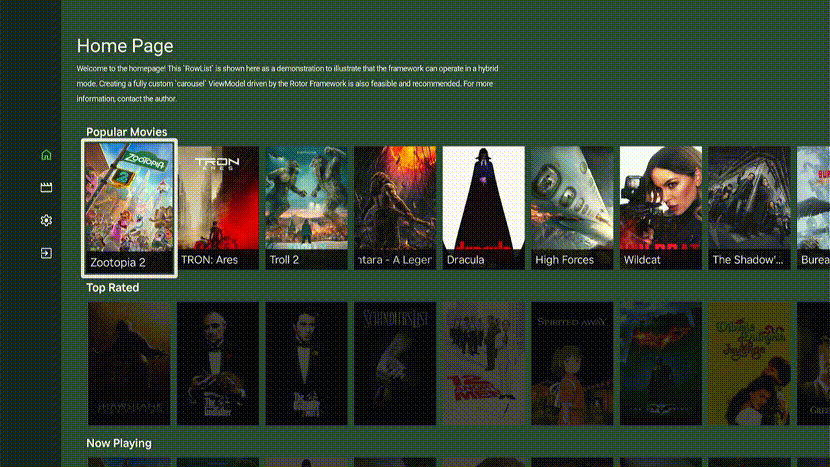

[](https://github.com/mobalazs/rotor-starter/actions/workflows/main-workflow.yml)


[](https://rokudevelopers.slack.com)

# 🚀 Rotor Starter

**A professional starter template for building Roku applications with the [Rotor Framework](https://github.com/mobalazs/rotor-framework).**

This GitHub template repository provides a complete boilerplate with best practices, example implementations, and a modern development workflow to help you kickstart your Roku app development journey.



---

## 📋 Table of Contents

- [What is a GitHub Template Repository?](#-what-is-a-github-template-repository)
- [Features](#-features)
- [Quick Start](#-quick-start)
- [Project Structure](#-project-structure)
- [Development Workflow](#️-development-workflow)
- [Rotor Framework Documentation](#-rotor-framework-documentation)
- [Build Commands](#-build-commands)
- [Customization](#-customization)
- [Contributing](#-contributing)
- [License](#-license)

---

## 🎯 What is a GitHub Template Repository?

A **GitHub template repository** is a special type of repository that serves as a starting point for new projects. Unlike forking, using a template creates a fresh repository with a clean Git history, allowing you to start your project without carrying over the template's commit history.

### How to Use This Template

1. **Click the "Use this template" button** at the top of this repository on GitHub
2. **Name your new repository** and choose visibility (public/private)
3. **Clone your new repository** to your local machine:
   ```bash
   git clone https://github.com/YOUR_USERNAME/YOUR_REPO_NAME.git
   cd YOUR_REPO_NAME
   ```
4. **Install dependencies**:
    ```bash
    # Install ropm globally (if not already installed)
    npm install -g ropm

    # Install npm dependencies
    npm install

    # Install Roku dependencies via ropm
    ropm install
    ```
5. **Start developing!** 🎉

---

### Prerequisites

- **Node.js** (v14 or higher)
- **npm** or **yarn**
- **ropm** (Roku Package Manager) - Install globally: `npm install -g ropm`
- **Roku device** or simulator
- **TMDB** API key before your first build, set up your TMDB API configuration:

### Configuration

#### 1. Get a TMDB API Key

The starter template uses **The Movie Database (TMDB)** API to display real movie content on the home page. To use this feature, you need a free API key:

1. **Create a TMDB account** at [https://www.themoviedb.org/signup](https://www.themoviedb.org/signup)
2. **Verify your email** and log in
3. **Navigate to API settings** at [https://www.themoviedb.org/settings/api](https://www.themoviedb.org/settings/api)
4. **Request an API key**:
   - Click "Request an API Key"
   - Choose "Developer" (for non-commercial use) or "Commercial" (for commercial projects)
   - Fill out the application form
   - Accept the Terms of Use
5. **Copy your API Key (v3 auth)**

#### 2. Configure the Project

```bash
# Copy the example config file
cp config.example.json config.json
```

Edit `config.json` and add your TMDB API key:

```json
{
  "TMDB_API_KEY": "your_api_key_here"
}
```

> **Important Notes:**
> - The `config.json` file is gitignored to keep your API keys secure
> - The API key will be automatically injected into the app manifest during build
> - Movie data is fetched in the user's selected language with English fallback
> - By using TMDB API, you agree to comply with [TMDB's Terms of Use](https://www.themoviedb.org/terms-of-use)


#### Set your local Roku Device access (`.env`)

```bash
cp sample.env .env
```

Replace the placeholders in `.env` with your Roku device's IP and developer password so the CLI scripts can sideload builds to your box. The `.env` file is gitignored; keep it local.

### First Build

```bash
npm run build-dev
```

This will:
1. Generate theme constants from `assetsJs/theme.js`
2. Generate translations from `assetsJs/translation.js`
3. Inject API keys from `config.json` into the manifest
4. Compile BrighterScript to BrightScript
5. Create a deployable package in `/out`

---

## 🛠️ Development Workflow

### 1. Watch Mode (Recommended for Development)

Use watch mode to automatically regenerate theme and translation constants:

```bash
npm run watch
```

This monitors `assetsJs/` for changes and automatically regenerates UI constants when you modify `theme.js` or `translation.js`.

### 2. Modify Theme or Translations

Edit the JavaScript files in `assetsJs/`:

**Theme (`assetsJs/theme.js`):**
```javascript
// Material Design 3 - Only seed colors needed!
const seedColors = {
    primary: '#6200EE',
    secondary: '#03DAC6',
    tertiary: '#A1D7E7'
};
// Full color palette auto-generated from seeds
```

**Translations (`assetsJs/translation.js`):**
```javascript
en_US: {
    appTitle: 'My Awesome App',
    // ... add translations
}
```

### 3. Manual Build

```bash
# Manually generate UI constants
npm run precompiler

# Development build (with source maps)
npm run build-dev

# Production build (optimized)
npm run build-prod
```

### 4. Access Generated Constants

Theme and translations are automatically available:

```brightscript
' In any BrighterScript file
UI.colors.primary           ' Access theme colors
UI.typography.titleLarge_aa ' Access typography
@l10n.appTitle              ' Access translations (see Fields Plugin doc)
```

**Note:** The `@` operator for accessing translations uses the Fields Plugin. See the [Fields Plugin Documentation](https://github.com/mobalazs/rotor-framework/blob/main/docs/view-builder-fields-plugin.md) for details on string interpolation and viewModelState references.

---

## 📚 Rotor Framework Documentation

This starter uses the **Rotor Framework** - a modern, ViewModel-first UI framework for Roku applications.

### Official Documentation

📖 **[Full Framework Documentation](https://github.com/mobalazs/rotor-framework)**

---

## 🔧 Build Commands

```bash
# Development
npm run watch            # Watch assetsJs/ and auto-regenerate on changes
npm run precompiler      # Manually generate theme/translation constants
npm run build-dev        # Development build with source maps

# Production
npm run build-prod       # Optimized production build

# Code Quality
npm run lint             # Lint BrighterScript code
npm run sca              # Run Static Channel Analysis
```

---

## 🎨 Customization

### Adding a New Page

1. **Create ViewModel** in `src/components/views/pages/`:

```brightscript
namespace ViewModels
    class MyNewPage extends ViewModels.BasePage
        override function template() as object
            return {
                nodeType: "Group",
                children: [
                    {
                        nodeType: "Label",
                        fields: {
                            text: "My New Page",
                            color: UI.colors.onBackground
                        }
                    }
                ]
            }
        end function
    end class
end namespace
```

2. **Register in Navigation** (`src/components/tasks/appTask/AppTask.bs`):

```brightscript
pageSettings: {
    mypage: {
        viewModel: ViewModels.MyNewPage
    }
}
```

3. **Add Menu Item** in translations and menu configuration

### Modifying Colors

The starter uses **Material Design 3 (MD3)** with dynamic color generation. You only need to specify **seed colors**:

Edit `assetsJs/theme.js`:

```javascript
const seedColors = {
    primary: '#YOUR_PRIMARY_COLOR',
    secondary: '#YOUR_SECONDARY_COLOR',
    tertiary: '#YOUR_TERTIARY_COLOR'
};
```

The system automatically generates:
- Full color palette with tonal variants
- All MD3 color roles (primary, secondary, surface, error, etc.)
- Hover/pressed states
- Elevation surfaces (6 levels using overlay alpha blending)
- State layers (hover, focus, pressed, dragged)

**CTV-Optimized:** Elevation uses calculated overlay alpha instead of shadows for Roku compatibility.

Run `npm run watch` (recommended) or `npm run build-dev` to regenerate constants.

### Adding Languages

Add to `assetsJs/translation.js`:

```javascript
de_DE: {
    languages: languages,
    appTitle: 'Meine App',
    // ... translations
}
```

---

## 📄 License

This project is licensed under the Apache License 2.0 — see the [LICENSE](LICENSE) file for details.

Built with [Rotor Framework](https://github.com/mobalazs/rotor-framework).

© 2025 Balázs Molnár
